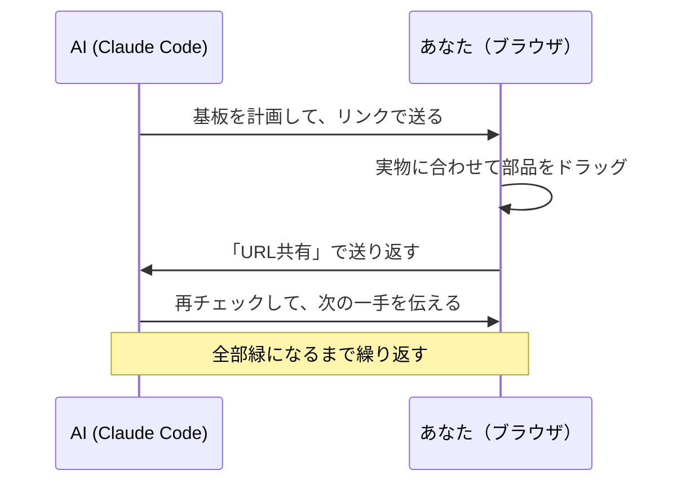

<div align="right"><a href="README.md">English</a> | 日本語</div>

<!--
  SYNC: README.md @ v0.6.13
  英語版 README.md が正本です。翻訳に遅れがある場合は英語版を優先してください。
  The English README is canonical; this translation may lag behind.
-->

# perfwire

**配線プランはAIが考える。あなたは実物に合わせてドラッグするだけ。間違いは、はんだ付けの前にルールチェッカーが見つける。**

[](https://github.com/KeckuJp/perfwire/actions/workflows/ci.yml)
[](https://github.com/KeckuJp/perfwire/releases)
[](LICENSE)


<picture>
  <source media="(prefers-reduced-motion: reduce)" srcset="docs/media/demo-filmstrip.png">
  
</picture>

*配線をわざと外す → 監査が即座に指摘 → Ctrl+Zで元通り。
（GIFは1回だけ再生されます — [静止画版](docs/media/demo-filmstrip.png)）*

**今すぐ試せます:** このリポジトリをcloneして `index.html` をブラウザで開くだけ。それがインストールの全てです。サンプル基板が最初から入っていて、その「Before」版にはチェッカーが検出済みの間違いが3つ仕込まれています。ドラッグで直してみてください。

- **1ファイルだけ。** アプリの全てが `index.html`。インストール不要・サーバー不要・アカウント不要。オフラインで動き、基板はURLひとつで共有できます。
- **人とAIで、得意なことを分担。** AIが配置と配線を考え、あなたは机の上の実物に合わせてドラッグで直す。リンクで送り返せば続きはAIがやります。
- **AIの当てずっぽうではなく、本物のチェック。** ショート・つなぎ忘れ・電解コンデンサの逆挿し——見つけるのはルールエンジンであって、言語モデルの「たぶん大丈夫」ではありません。AIは提案するだけで、合否の判定はしません。

## 何を解決するのか

ユニバーサル基板の工作は、回路図が間違っていて失敗することはあまりありません。失敗するのは組み立てです。ジャンパー線が1穴ずれる、はんだブリッジが隣のパッドに乗る、パスコンが守るべきピンから遠くなる——。AIには机の上の基板は見えないし、どの穴に何を挿すかを全部頭で覚えておくのは、部品が10個を超えたあたりで破綻します。

だからperfwireは仕事を分けます:



AIは帳簿仕事（どの穴・どのブリッジ・どのルール）を引き受け、あなたは人間にしかできないこと——計画を物理的な現実に合わせること——に集中できます。

## 60秒で試す

1. このリポジトリをcloneする。
2. `index.html` をブラウザで開く。サンプルの **Pico Plant Sitter**（Raspberry Pi Picoの水やり監視基板）が2バージョン入っています: 間違い3つ入りの「Before」と、全部緑の「Recommended」。
3. 部品や配線の端をドラッグして、**配線を再計算**や**配置を再提案**を押して、監査パネルの反応を見る。
4. **書き出し**で基板がJSONファイル1つになります。コミットするなり、共有するなり、Claude Codeに渡すなり。

## 単体でも使える。AIと組むともっと良い。

Claude Codeが無くても、perfwireはそれだけで完結したツールです:

1. **ブラウザだけ** — パレットから部品を追加（KiCADネットリストの取り込みも可）してドラッグ。配線とチェックは内蔵ソルバーがやります。
2. **目的を選ぶ** — 「組みやすさ」「アナログ・高感度」「省スペース」から選んで再配置。切断長リスト付きの組み立てシートも出せます。
3. **Claude Codeを足す**とループが閉じます: 回路を言葉で説明→計画済みの基板がリンクで届く→ドラッグ→返す→繰り返し。

## Claude Codeと一緒に使う

```bash
git clone https://github.com/KeckuJp/perfwire.git
cd perfwire
claude .
```

これだけです。同梱のスキルが自動で読み込まれ、基板配線の話題になると動き出します:

```
あなた: 「この回路をユニバーサル基板に組みたい」（回路図やネットリストを渡す）
AI:     基板を計画 → リンクを送ってくる
あなた: 開く → 実物に合わせてドラッグ → 「URL共有」を押す
AI:     リンクを読み戻す → 再チェック → 次の一手を教えてくれる
```

AIから届いた基板を開くと、エディタ上部に**Claude Code連携バー**が出ます。AIからの指示と「Claude Codeに戻す」ボタンがあるので、初めてでも次に何をすればいいか迷いません。

<details>
<summary>プラグインとしてインストールする / トラブルシューティング</summary>

このリポジトリはそれ自体がプラグインマーケットプレイスを兼ねています:

```
/plugin marketplace add KeckuJp/perfwire
/plugin marketplace update perfwire
/plugin install perfwire@perfwire
```

install の前に必ず `update` の行を実行してください（サードパーティのマーケットプレイスは自動更新されません）。

プラグインとして入れた場合、同梱ファイルはプラグインキャッシュ（`~/.claude/plugins/cache/…`）にあり、あなたのプロジェクトには入りません。スキルが絶対パスで見つけるのでそのまま動きますが、もしAIが `Python was not found` や `can't open file 'solver.py'` と言い出したら、もう一度聞き直すか、`update` → install をやり直してください。

CLIメモ: `solver.py` は標準ライブラリのみのPythonです（macOS/Linuxは `python3`、Windowsは `python`）。設定ファイル `config.example.json` は自動で読み込まれ、見つからない場合は黙って手抜きせずに大きな警告（`EE audit DEGRADED`）を出します。`tools/make_link.py out.json` で基板ファイルを共有リンクに変換できます。

</details>

## はんだ付けの前に何をチェックするのか

監査が見つけるものの例:

| 見つけるもの | 例 | 深刻度 |
|---|---|---|
| 基板自体の銅箔によるショート | 未カットのストリップや十字配線が2つのネットを繋いでいる | hard NG |
| 断線・つなぎ忘れ | 最後まで繋がっていないネット、ネット未割当の足 | hard NG |
| 1本のネットで出力同士が衝突 | 基板の外から線で入ってくる出力も含む | hard NG |
| 電解コンデンサの逆挿し | 電源レールに対して極性をチェック | hard NG |
| パスコンがピンから遠すぎる | 実際の基板上の距離で測る | しきい値 |
| 抵抗の定格オーバー | 抵抗値とレール電圧を与えた場合 | しきい値 |
| 危ういグラウンド・クロストーク | 数珠つなぎのリターン、長い並走 | 助言 |

結果はひとつの判定にまとまります: **fab-ready（組んでよし）か、直すべき箇所の具体的なリストか。**

## 結果を信用できる理由

同じルールチェッカーが2回実装されています——ブラウザ内とPython（`solver.py`）。この2つがどのサンプル基板のどのチェックでも食い違わないことを、CIが毎回検証しています。AIが「この基板はきれいです」と言うとき、その根拠はあなたが読めるルールエンジンであって、モデルの自信ではありません。

**正直な注意をひとつ:** 監査が緑でも、それは「上記の特定のチェックに通った」という意味です。通電して安全という証明ではないので、初めて電源を入れる前には必ず実物を自分の目で確認してください。詳しくは [`SAFETY.md`](SAFETY.md)（英語）。

<details>
<summary>毎push実行される7つのCIゲート</summary>

- `extract_check.mjs` — アプリ本体のスクリプトが構文的に正しく、サンプルデータが有効。
- `i18n_check.mjs` — 全UIメッセージが英日両方に存在する。
- `check_manifests.mjs` — プラグインマニフェストの整合、READMEの相互リンク。
- `parity_check.mjs` — ブラウザ版とsolver.pyの監査が全サンプルでフィールド単位一致。
- `parity_headless.mjs` — 実際のエディタをheadlessで動かし、幾何計算までsolver.pyと突合。
- `ci_smoke.py` — solver.pyが全サンプルを完全配線し、固定済みの検出結果を再現する。
- `consume_smoke.py` — cloneでなく「インストールした状態」でプラグインが動く。

</details>

## 特長

**抽象的な回路図ではなく、物理的な基板をモデル化**
- 1穴=1本の足か1本の線。ジャンパーはターゲットの隣の空き穴に入り、はんだブリッジで繋ぐ——実物の作法そのまま。
- 出典付きの実寸フットプリント: 部品は穴を塞ぎ、背の高い部品同士は重ねられず、抵抗は立て実装もできる。
- どんな部品でも載る: PicoもリレーもコネクタもピンがあるものはICとして、2本足のものは抵抗型として表現。部品ごとの専用コードは不要。
- 実在する基板の種類を知っている: 独立ランド、ストリップ基板（ベロボード）、十字配線基板（全穴が隣と繋がって出荷される——必要なカット箇所を監査が全部教えてくれる）。

**あなたのための、エディタ**
- **3Dビュー** — ドラッグで回転、ホイールでズーム。部品は曲がったリードとはんだフィレット付きの実形状で描画。ネットにホバーすると他が薄くなる。
  <details><summary>▶ 3Dビューを見る（GIF、ループ再生）</summary>

  

  </details>
- **写真下絵** — 実物の基板の写真をグリッドの下に敷いて、なぞるように部品をドラッグ。
- **ガイド付きはんだ付け** — 1接点ずつ、今の手順だけがハイライト。裏面用のミラー表示、進捗は保存される。
- **仮想導通テスター** — 2穴クリックで「鳴るべきか」が分かる。テスター用チェックリストも書き出せる。
- **URLで共有** — 基板全体がリンクに圧縮される。サーバーもアカウントも不要。
- ほかにも: KiCADネットリスト取り込み、原寸1:1印刷、任意バージョンとのdiff表示、undo/redo、コマンドパレット、自動保存、UI・レポートとも日英対応。

**AIのための、CLI**
- `solver.py` がコマンドラインから配置・配線・監査。ブラウザと同じエンジン、同じ結果。
- 配置の目的プリセット（`--profile easy|analog|compact`）、ガードリング合成、config叩き台生成、ビルドパケット出力、入力チェック（lint）。

<details>
<summary>状態スキーマ（v1）— 人とAIが読み書きする1つのJSON</summary>

```jsonc
{
  "grid": { "cols": 17, "rows": 14 },
  "netColors": { "VCC": "#d62839" },
  "leads":  { "U1.8": { "net": "VCC", "at": [6, 2] },
              "W.MCU_TX": { "net": "TX", "at": [1, 4], "role": "out" } },
  "parts": [
    { "id": "U1", "kind": "ic", "label": "U1", "pins": { "1": [6,5] }, "locked": true,
      "pinTypes": { "1": "out", "2": "in", "8": "pwr_in" } },
    { "id": "R1", "kind": "r", "label": "R1 1M", "leads": [[13,2],[16,2]],
      "leadNames": ["R1.a","R1.b"], "locked": false, "standing": false }
  ],
  "padBridges": [ [[5,1],[5,2]] ],
  "wires": [ { "net": "VCC",
    "a": { "tap": "U1.8", "pad": [6,2], "hole": [6,1], "bridgeTo": [6,2], "direct": false },
    "b": { "tap": "U2.8", "pad": [12,10], "hole": [12,9], "bridgeTo": [12,10], "direct": false } } ],
  "blockedHoles": [ [3,7] ]
}
```

ワイヤの端点は `hole`（銅線を挿す穴）と `bridgeTo`（はんだブリッジで繋ぐ隣の同ネット穴）の組。同梱: 教材サンプル2枚（`examples/`）、ソルバー設定（`config.example.json`）、基板⇄リンク変換の `tools/make_link.py` / `tools/read_link.py`。

</details>

## 背景

perfwireは、実際にユニバーサル基板を1枚手作りする中から生まれました。写真から穴位置を推測するやり方は3回失敗し、最後にうまくいったのが「ドラッグエディタ＋ソルバー＋監査」のループでした。それを誰でも使える形にしたのがこのツールです。

## フィードバック

Claude Codeで使っていて何か気づいたら、AIに一言どうぞ——「これをperfwireに報告して」。AIが下書きを作り、**送る前に必ずあなたに確認します**。直接送る場合は: [バグ報告](../../issues/new?template=1_bug_report.yml) · [監査判定への異議](../../issues/new?template=2_erc_dispute.yml) · [機能要望](../../issues/new?template=3_feature_request.yml)。

## コントリビュート・翻訳

[`CONTRIBUTING.md`](CONTRIBUTING.md)（英語）を参照——検証ゲートのコマンドと、新しい言語のREADMEを追加する手順があります。

## ライセンス

Apache License 2.0 — [`LICENSE`](LICENSE) と [`NOTICE`](NOTICE) を参照。
