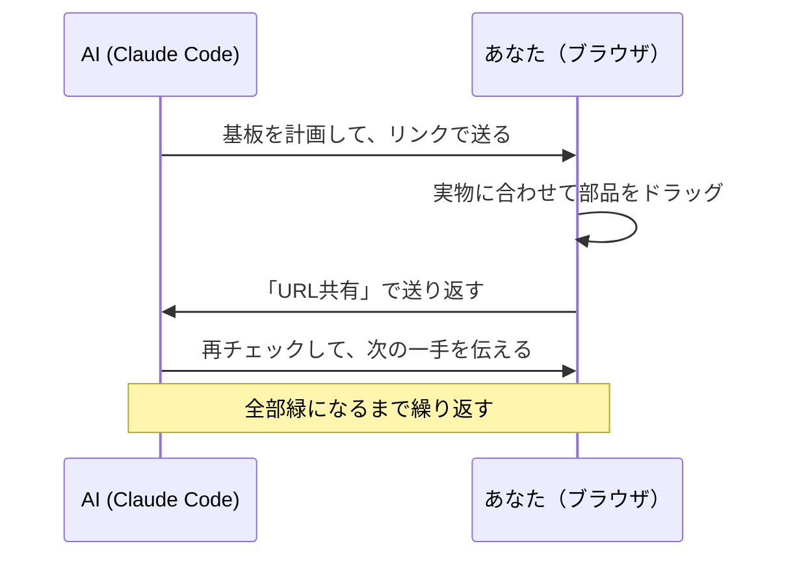

<div align="right"><a href="README.md">English</a> | 日本語</div>

<!--
  SYNC: README.md @ v0.7.0
  英語版 README.md が正本です。翻訳に遅れがある場合は英語版を優先してください。
  The English README is canonical; this translation may lag behind.
-->

# perfwire

**AI に回路は設計してもらえた。でも、机の上の基板に配線することはしてもらえなかった。だから perfwire を作った。ユニバーサル基板をまるごとブラウザで組んで、はんだ付けの前に配線の間違いを見つける道具だ。**

[](https://github.com/KeckuJp/perfwire/actions/workflows/ci.yml)
[](https://github.com/KeckuJp/perfwire/releases)
[](LICENSE)


<picture>
  <source media="(prefers-reduced-motion: reduce)" srcset="docs/media/demo-filmstrip.png">
  
</picture>

*配線をわざと外す → 監査がすぐ指摘 → Ctrl+Zで元通り。
（GIFは1回だけ再生される。静止画は [こちら](docs/media/demo-filmstrip.png)）*

私に何度も起きていたのは、こういうことだ。画面の上ではちゃんと動く設計が、いざユニバーサル基板に手ではんだ付けし始めた途端に崩れる。ジャンパー線が1穴ずれただけで動かなくなり、しかも百カ所ある接点のどれが悪いのか手がかりがない。最後にちゃんと計画どおりの基板ができたのが、この流れだった。まずブラウザで基板をまるごと組んで、チェッカーに間違いを見つけさせて、それからはんだごてを握る。perfwire はそのワークフローそのものだ。アプリの全ては1つの `index.html`。インストールもサーバーもアカウントも要らず、オフラインで動いて、組み上がった基板はURLひとつで誰にでも渡せる。

**今すぐ試す:** このリポジトリをcloneして `index.html` を開き、あとはドラッグするだけ。間違いが3つ仕込まれたサンプル基板が最初から入っている。（手順は下に。）

## 何を解決するのか

ユニバーサル基板の工作は、回路図が間違っていて失敗することはあまりない。失敗するのは組み立てだ。ジャンパー線が1穴ずれる、はんだブリッジが隣のパッドに乗る、パスコンが守るべきピンから遠くなる。AIには机の上の基板は見えないし、どの穴に何を挿すかを全部頭で覚えておくのは、部品が10個を超えたあたりで破綻する。

だからperfwireは仕事を分ける:



AIはどの穴・どのブリッジ・どのルールという帳簿仕事を引き受ける。その計画を目の前の実物に合わせる作業だけは、あなたの手に残る。

## ちょっと触ってみる

1. このリポジトリをcloneする。
2. `index.html` をブラウザで開く。サンプルの **Pico Plant Sitter**（Raspberry Pi Picoの水やり監視基板）が2バージョン入っている: 間違い3つ入りの「Before」と、全部緑の「Recommended」。
3. 部品や配線の端をドラッグして、**配線を再計算**や**配置を再提案**を押し、監査パネルの反応を見る。
4. **書き出し**で基板がJSONファイル1つになる。コミットするなり、共有するなり、Claude Codeに渡すなり。

## 単体でも使える。AIと組むともっと良い。

Claude Codeが無くても、perfwireはそれだけで完結したツールだ:

1. **ブラウザだけ。** パレットから部品を追加（KiCADネットリストの取り込みも可）してドラッグ。配線とチェックは内蔵ソルバーがやる。
2. **目的を選ぶ。** 「組みやすさ」「アナログ・高感度」「省スペース」から選んで再配置。切断長リスト付きの組み立てシートも出せる。
3. **Claude Codeを足す。** これでループが閉じる。流れは次の節で。

## Claude Codeと一緒に使う

```bash
git clone https://github.com/KeckuJp/perfwire.git
cd perfwire
claude .
```

これだけ。同梱のスキルが自動で読み込まれ、基板配線の話題になると動き出す:

```
あなた: 「この回路をユニバーサル基板に組みたい」（回路図やネットリストを渡す）
AI:     基板を計画 → リンクを送ってくる
あなた: 開く → 実物に合わせてドラッグ → 「URL共有」を押す
AI:     リンクを読み戻す → 再チェック → 次の一手を教えてくれる
```

AIから届いた基板を開くと、エディタ上部に**Claude Code連携バー**が出る。AIからの指示と「Claude Codeに戻す」ボタンがあるので、初めてでも次に何をすればいいか迷わない。

<details>
<summary>プラグインとしてインストールする / トラブルシューティング</summary>

このリポジトリはそれ自体がプラグインマーケットプレイスを兼ねている:

```
/plugin marketplace add KeckuJp/perfwire
/plugin marketplace update perfwire
/plugin install perfwire@perfwire
```

install の前に必ず `update` の行を実行する（サードパーティのマーケットプレイスは自動更新されない）。

プラグインとして入れた場合、同梱ファイルはプラグインキャッシュ（`~/.claude/plugins/cache/…`）にあり、あなたのプロジェクトには入らない。スキルが絶対パスで見つけるのでそのまま動くが、もしAIが `Python was not found` や `can't open file 'solver.py'` と言い出したら、もう一度聞き直すか、`update` → install をやり直せばいい。

CLIメモ: `solver.py` は標準ライブラリのみのPythonだ（macOS/Linuxは `python3`、Windowsは `python`）。設定ファイル `config.example.json` は自動で読み込まれ、見つからない場合は黙って手抜きせず大きな警告（`EE audit DEGRADED`）を出す。`tools/make_link.py out.json` で基板ファイルを共有リンクに変換できる。

</details>

## はんだ付けの前に何をチェックするのか

監査が見つけるものの例:

| 見つけるもの | 例 | 深刻度 |
|---|---|---|
| 基板自体の銅箔によるショート | 未カットのストリップや十字配線が2つのネットを繋いでいる | hard NG |
| 断線・つなぎ忘れ | 最後まで繋がっていないネット、ネット未割当の足 | hard NG |
| 1本のネットで出力同士が衝突 | 基板の外から線で入ってくる出力も含む | hard NG |
| 電解コンデンサの逆挿し | 電源レールに対して極性をチェック | hard NG |
| パスコンがピンから遠すぎる | 実際の基板上の距離で測る | しきい値 |
| 抵抗の定格オーバー | 抵抗値とレール電圧を与えた場合 | しきい値 |
| 危ういグラウンド・クロストーク | 数珠つなぎのリターン、長い並走 | 助言 |

結果はひとつの判定にまとまる: **fab-ready（組んでよし）か、直すべき箇所の具体的なリストか。**

## 結果を信用できる理由

同じルールチェッカーが2回実装されている。ブラウザ内とPython（`solver.py`）の2つが、どのサンプル基板のどのチェックでも食い違わないことを、CIが毎回検証している。AIが「この基板はきれいです」と言うとき、その根拠はあなたが読めるルールエンジンであって、モデルの自信ではない。

**正直な注意をひとつ:** 監査が緑でも、それは「上記の特定のチェックに通った」という意味だ。通電して安全という証明ではないので、初めて電源を入れる前には必ず実物を自分の目で確認してほしい。詳しくは [`SAFETY.md`](SAFETY.md)（英語）。

<details>
<summary>毎push実行される7つのCIゲート</summary>

- `extract_check.mjs`：アプリ本体のスクリプトが構文的に正しく、サンプルデータが有効。
- `i18n_check.mjs`：全UIメッセージが英日両方に存在する。
- `check_manifests.mjs`：プラグインマニフェストの整合、READMEの相互リンク。
- `parity_check.mjs`：ブラウザ版とsolver.pyの監査が全サンプルでフィールド単位一致。
- `parity_headless.mjs`：実際のエディタをheadlessで動かし、幾何計算までsolver.pyと突合。
- `ci_smoke.py`：solver.pyが全サンプルを完全配線し、固定済みの検出結果を再現する。
- `consume_smoke.py`：cloneでなく「インストールした状態」でプラグインが動く。

</details>

## 特長

**物理的な基板そのものをモデル化**
- 1穴=1本の足か1本の線。ジャンパーはターゲットの隣の空き穴に入り、はんだブリッジで繋ぐ。実物の作法そのままだ。
- 出典付きの実寸フットプリント。部品は穴を塞ぎ、背の高い部品同士は重ねられず、抵抗は立て実装もできる。
- どんな部品でも載る。PicoもリレーもコネクタもピンがあるものはICとして、2本足のものは抵抗型として表現する。部品ごとの専用コードは要らない。
- 実在する基板の種類を知っている。独立ランド、ストリップ基板（ベロボード）、そして全穴が隣と繋がって出荷される十字配線基板（必要なカット箇所は監査が全部教えてくれる）。

**あなたのための、エディタ。** 一番よく手を伸ばすのは3Dビューだ。ドラッグで回転、ホイールでズーム、そして密集した基板でもどの配線がどこへ行くのかを実際に確かめられる。ネットを1つだけ分離したり、部品の本体をX線で透かして下を通る配線を見つけたり、ピンにホバーして接続先を読んだり。部品は曲がったリードとはんだフィレット付きの実形状で描かれる。
  <details><summary>▶ 3Dビューを見る（GIF、ループ再生）</summary>

  

  </details>

- **写真下絵。** 実物の基板の写真をグリッドの下に敷いて、なぞるように部品をドラッグ。
- **ガイド付きはんだ付け。** 1接点ずつ、今の手順だけがハイライト。裏面用のミラー表示があり、進捗も保存される。
- **導通チェック。** 2穴クリックで「鳴るべきか」が分かり、ネットごとのテスター用チェックリストも書き出せる。通電前に配線ミスを捕まえられる。
- **URLで共有。** 基板全体がリンクに圧縮される。サーバーもアカウントも要らない。

残りは必要になったときに使えばいい。KiCADネットリスト取り込み、原寸1:1印刷、任意バージョンとのdiff表示、undo/redo、コマンドパレット、自動保存、UI・レポートとも日英対応。

**AIのための、CLI**
- `solver.py` がコマンドラインから配置・配線・監査。ブラウザと同じエンジン、同じ結果だ。
- 配置の目的プリセット（`--profile easy|analog|compact`）、ガードリング合成、config叩き台生成、ビルドパケット出力、入力チェック（lint）。

<details>
<summary>状態スキーマ（v1）— 人とAIが読み書きする1つのJSON</summary>

```jsonc
{
  "grid": { "cols": 17, "rows": 14 },
  "netColors": { "VCC": "#d62839" },
  "leads":  { "U1.8": { "net": "VCC", "at": [6, 2] },
              "W.MCU_TX": { "net": "TX", "at": [1, 4], "role": "out" } },
  "parts": [
    { "id": "U1", "kind": "ic", "label": "U1", "pins": { "1": [6,5] }, "locked": true,
      "pinTypes": { "1": "out", "2": "in", "8": "pwr_in" } },
    { "id": "R1", "kind": "r", "label": "R1 1M", "leads": [[13,2],[16,2]],
      "leadNames": ["R1.a","R1.b"], "locked": false, "standing": false }
  ],
  "padBridges": [ [[5,1],[5,2]] ],
  "wires": [ { "net": "VCC",
    "a": { "tap": "U1.8", "pad": [6,2], "hole": [6,1], "bridgeTo": [6,2], "direct": false },
    "b": { "tap": "U2.8", "pad": [12,10], "hole": [12,9], "bridgeTo": [12,10], "direct": false } } ],
  "blockedHoles": [ [3,7] ]
}
```

ワイヤの端点は `hole`（銅線を挿す穴）と `bridgeTo`（はんだブリッジで繋ぐ隣の同ネット穴）の組だ。同梱: 教材サンプル2枚（`examples/`）、ソルバー設定（`config.example.json`）、基板⇄リンク変換の `tools/make_link.py` / `tools/read_link.py`。

</details>

## フィードバック

Claude Codeで使っていて何か気づいたら、AIにこう言えばいい。「これをperfwireに報告して」。AIが下書きを作り、**送る前に必ずあなたに確認する**。直接送る場合は: [バグ報告](../../issues/new?template=1_bug_report.yml) · [監査判定への異議](../../issues/new?template=2_erc_dispute.yml) · [機能要望](../../issues/new?template=3_feature_request.yml)。

## コントリビュート・翻訳

[`CONTRIBUTING.md`](CONTRIBUTING.md)（英語）を参照。検証ゲートのコマンドと、新しい言語のREADMEを追加する手順がある。

## ライセンス

Apache License 2.0。[`LICENSE`](LICENSE) と [`NOTICE`](NOTICE) を参照。
