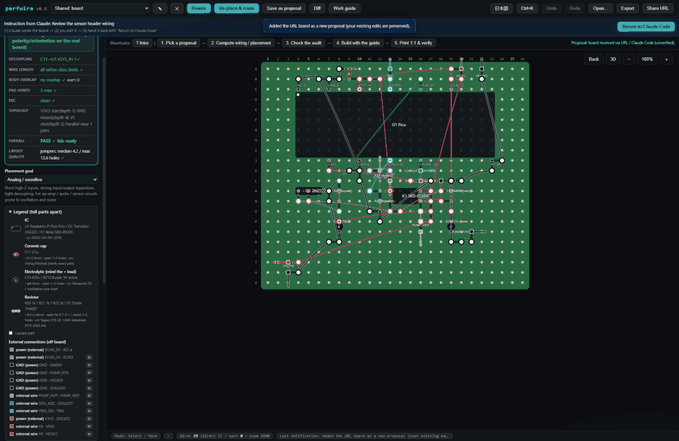
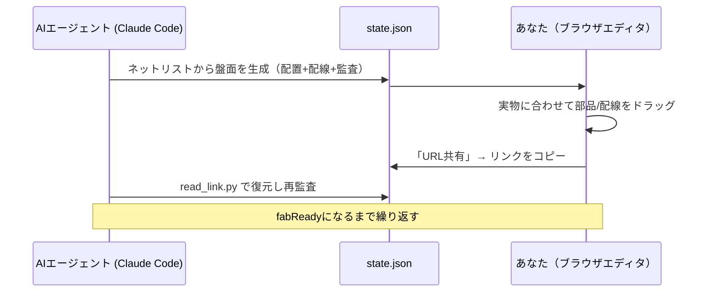
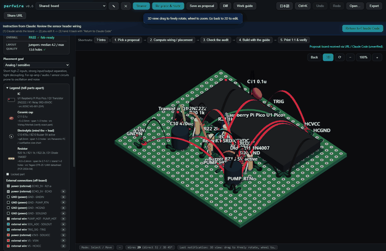

<div align="right"><a href="README.md">English</a> | 日本語</div>

<!--
  SYNC: README.md @ v0.6.13
  英語版 README.md が正本です。翻訳に遅れがある場合は英語版を優先してください。
  The English README is canonical; this translation may lag behind.
-->

# perfwire

**ユニバーサル基板（蛇の目基板）の手はんだ配線を、AIエージェントが配置・配線し、あなたが実物に合わせてドラッグし、決定論的なERC（電気ルールチェック）が両者の食い違いを通電前に検出する。単一HTMLファイル・依存ゼロ・オフライン動作。**

[](https://github.com/KeckuJp/perfwire/actions/workflows/ci.yml)
[](https://github.com/KeckuJp/perfwire/releases)
[](LICENSE)


<picture>
  <source media="(prefers-reduced-motion: reduce)" srcset="docs/media/demo-filmstrip.png">
  
</picture>

*(アニメーションGIF、動きは約2秒、1回再生で停止 — 読み込めない場合は[静止画版](docs/media/demo-filmstrip.png))*

1. ワイヤ端点を接続先の穴から引き離す
2. 監査パネルが即座に未結線ネットを指摘する
3. Ctrl+Zで盤面がfab-readyに復帰する

**今すぐ試す:** このリポジトリをclone して `index.html` を好きなブラウザで開くだけ（インストール不要・サーバー不要・アカウント不要）。実例（Raspberry Pi Picoの自動水やり監視基板）が最初から埋め込まれており、その「Before」案には監査がすでに検出済みの意図的なミスが3つ含まれている。ドラッグで直して監査パネルが緑になるところまで見てほしい。

- **単一ファイル。** `index.html` がアプリの全て — ビルドステップ無し・npm無し・サーバー無し。盤面状態はURLとして共有でき、オフラインで動く。
- **人とAIの正しい分担。** エージェントがネットリストから配置・配線を生成し、あなたが実物に合わせてドラッグで直し、リンクで送り返す。
- **雰囲気判定でなく決定論的検証。** ショート・未結線・出力競合・デカップリング距離など、ブラウザJSとPythonの両方で同一に動くルールエンジンがチェックし、CIで両者の一致を保証している。LLMは提案するだけで、判定者にはならない。

## なぜperfwireなのか

ユニバーサル基板の製作は、決まったパターンで失敗する。ネットリストは正しいのに、物理的な実行——どの穴にどのジャンパーを挿すか、どのパッドをはんだブリッジするか、デカップリングコンデンサが実際どこに座っているか——が計画からずれていく。この作業のどちらの半分も、片方だけでやるのには向いていない。AIエージェントは机の上の実物の基板を見ることができないし、穴ごとの配線ルールを人間が頭の中だけで追い続けるのはスケールしない。

perfwireはこの作業をあるべき形で分担し、両者は1つの共有JSON状態ファイルを通じて対話する:



- **AIエージェント**がネットリストから盤面状態を生成し、ジャンパーの端点を空き穴へ自動割当（銅線は部品の足と同じ穴に刺さらない）、物理的・電気的制約下での配置を提案し、結果を監査する。
- **人間**が物理的な現実——ロック済みの部品・使えない穴・実際の部品位置——に合わせてドラッグで直し、状態をエージェントへ返す。

## 60秒で試す

1. このリポジトリをclone する。
2. `index.html` を好きなブラウザで開く（インストール不要・サーバー不要・単一ファイル）。サンプルプロジェクトが埋め込み済み: **Pico Plant Sitter**（Raspberry Pi Picoの自動水やり基板）。ソルバーが検出済みの意図的なミス3つを含む「Before」案と、クリーンな「Recommended」案がある。
3. 配線の端点/部品をドラッグし、スライダーでしきい値を調整し、**配線を再計算**または**配置を再提案**を押す。
4. **書き出し**で盤面状態JSON全体をエクスポート——Claude Codeに渡してより深い監査をするか、プロジェクトのリポジトリにコミットする。

## 単体でも動く。エージェントと組むとさらに良い

perfwireはClaude Codeが無くても完結したツールだが、AI支援ループへの入り口も用意されている:

1. **AI無し** — `index.html` を開き、パレットから部品を追加するかKiCADネットリストを取り込み、ドラッグし、内蔵ソルバーに配線・監査させる。
2. **内蔵ソルバー** — 配置の目的（組みやすさ/アナログ/省スペース）を選び、再計算し、切断長リスト付きのビルドパケットを書き出す。
3. **Claude Codeとのフルループ** — エージェントが回路図から盤面状態を生成し、`solver.py`でより深い監査を行い、URLを介してあなたと盤面をやり取りする。

## Claude Codeとの往復ループ

**基本 — cloneしてプロジェクトとして開く**（最も摩擦が少ない）:

```bash
git clone https://github.com/KeckuJp/perfwire.git
cd perfwire
claude .
```

ワークスペース信頼のプロンプトに一度同意すれば、同梱スキル（`.claude/skills/perfwire/SKILL.md`）が自動読み込みされ、perfboard/配線の依頼で発火する。状態スキーマと協働ループをエージェントに教える:

```
あなた:      「この回路をユニバーサル基板に組みたい」（ネットリスト/回路図を渡す）
エージェント: state JSON を生成 → solver.py で配置+配線+監査 → index.html#z= リンクで盤面を渡す
あなた:      リンクを開く → 実物に合わせてドラッグ → 「URL共有」を押す（リンクがクリップボードに入る）
エージェント: 貼られたリンクを read_link.py で盤面に復元 → 再監査 → 次の1手を平易に指示
             （初心者はこの「押す→戻す」の小さな往復を何度も繰り返す。書き出しは Downloads にも
              保存され、エージェントがそのファイルを直接読んでもよい）
```

エージェントが `make_link.py out.json --task "…やってほしいこと…"` でリンクを組み立てると、エディタ上部に**Claude Code連携バー**が表示される: エージェントからの指示、3手順の往復リマインダー、そして盤面をリンクとしてコピーする**「Claude Codeに戻す」**ボタン。このバーは`#z=`リンクから開いた盤面にのみ表示される。

<details>
<summary>プラグインとしてインストールする方法・トラブルシューティング</summary>

**代替 — プラグインとしてインストール**（このリポジトリ自体が単一プラグインのマーケットプレイスを兼ねる）:

```
/plugin marketplace add KeckuJp/perfwire
/plugin marketplace update perfwire
/plugin install perfwire@perfwire
```

サードパーティのマーケットプレイスは自動更新されないため、install/reinstall前は必ず
`/plugin marketplace update perfwire` を実行すること（そうしないとadd時点でキャッシュされた
バージョンのままになる）。

このように利用する場合、同梱の `solver.py` / `tools/*.py` / `config.example.json` / `index.html`
はプラグインキャッシュ（`~/.claude/plugins/cache/…`）内にあり、あなたのプロジェクトには**無い**。
スキルはこれらを絶対パスで解決し、どのcwdからでも実行する。

> **トラブルシューティング:** `Python was not found`（Windows Storeの偽スタブ。実際のインタプリタは
> `python`）や `can't open file 'solver.py'` に遭遇したら、同梱スクリプトを誤ったフォルダから
> 実行している。Claudeに再度聞き直せばスキルを読み直して正しいプラグインの場所を特定する。

</details>

## 通電前にチェックされる内容

監査は、はんだごてを握る前に盤面グラフに対して実行される。チェックの一部（全リストと詳細は
[英語版](README.md#what-it-checks-before-you-solder)を参照）:

| チェック | 検出内容 | 深刻度 |
|---|---|---|
| `netMerge` / `stripShorts` | 基板自体の銅箔（未カットの十字配線・ストリップ基板のセグメント）が、独立していると想定していたネットを短絡させている | hard NG |
| `openNets` / `unconnectedLeads` | 配線が完全に接続していないネット、ネット未割当の部品リード | hard NG |
| `multipleDrivers` | 出力競合——1ネットに2つ以上の出力端子（配線経由で外部から来る出力も含む） | hard NG |
| `polarity` | 電解コンデンサの極性逆挿し（`rail_rank`設定時） | hard NG |
| `decouplingCoverage` | デカップリングコンデンサがサービスするピンから遠すぎる | しきい値 |
| `grounding` / `guard` / `crosstalk` | デイジーチェーン接地・高Zガード助言・並走配線の結合ヒューリスティック | advisory |

## 決定論的であることの設計思想

perfwireは同じ電気ルールチェッカーを2度実装している——ブラウザJSと、CLI/CI用の`solver.py`。
CIはこの2つがサンプル盤面すべてで一致した監査判定を返すことを、フィールド単位で検証している。
エージェントが「盤面はクリーンです」と言うとき、その根拠はLLMの自信でなく、あなたが読めるルール
エンジンに基づいている。

**これはadvisory（助言）であり、安全性の証明ではない** — クリーンな監査結果は、上記の特定の
チェックに通ったことを意味するのみで、その基板に安全に通電できることを保証するものではなく、
初めて通電する前の独立した人間による目視確認の代わりにもならない。詳細は`SAFETY.md`
（[英語](SAFETY.md)）を参照。

## 特長

詳細は[英語版](README.md#features)を参照——技術的な内容は言語間で同一:

- **物理現実のモデリング** — 穴単位で正確なモデル、実寸フットプリント、`kind`=幾何プリミティブという開いた部品モデル（Raspberry Pi Pico・リレー・コネクタも`ic`一つで表現）。基板トポロジは独立ランドのほか `strip`（ベロボード）・`mesh`（十字配線、秋月P-09694等）にも対応
- **人間向けエディタ** — **WebGL 3Dビュー**（ドラッグでオービット回転、部品は実形状で描画、密集盤面でのネットハイライト）、写真下絵トレース、ガイド付きはんだ付けモード、仮想導通テスター、共有URL、部品パレット、KiCADネットリスト取り込み、1:1印刷、diffビュー
  <details><summary>▶ 3Dビューを見る（アニメーションGIF、動き約2秒、ループ再生）</summary>

  

  </details>
- **エージェント向けCLI＆往復** — 配置の目的プリセット（`--profile easy|analog|compact`）、ガードリング合成、config叩き台生成、ビルドパケット出力、値考慮EE検査、入力lint

## 状態スキーマ（v1）

```jsonc
{
  "grid": { "cols": 17, "rows": 14 },
  "netColors": { "VCC": "#d62839" },
  "leads":  { "U1.8": { "net": "VCC", "at": [6, 2] },
              "W.MCU_TX": { "net": "TX", "at": [1, 4], "role": "out" } },
  "parts": [
    { "id": "U1", "kind": "ic", "label": "U1", "pins": { "1": [6,5] }, "locked": true,
      "pinTypes": { "1": "out", "2": "in", "8": "pwr_in" } },
    { "id": "R1", "kind": "r", "label": "R1 1M", "leads": [[13,2],[16,2]],
      "leadNames": ["R1.a","R1.b"], "locked": false, "standing": false }
  ],
  "padBridges": [ [[5,1],[5,2]] ],
  "wires": [ { "net": "VCC",
    "a": { "tap": "U1.8", "pad": [6,2], "hole": [6,1], "bridgeTo": [6,2], "direct": false },
    "b": { "tap": "U2.8", "pad": [12,10], "hole": [12,9], "bridgeTo": [12,10], "direct": false } } ],
  "blockedHoles": [ [3,7] ]
}
```

フィールドの完全な意味・同梱サンプルファイルの詳細は[英語版](README.md#state-schema-v1)を参照。

## 背景

実際にperfboardを手作業で組んだ経験から生まれた: 写真ベースでの位置推測は3回失敗し、
最終的にドラッグエディタ＋ソルバー＋監査のループだけがうまくいった。perfwireはそのワークフローを
汎用ツールとして一般化したもの。

## ロードマップ

配線経路をモデル化したクロストーク検査（現状はエンドポイント間ヒューリスティック）や、
ガード/keep-awayのさらなる改善が主な今後の方向性。出荷済みの内容は`CHANGELOG.md`を参照。

## フィードバック

Claude Codeでperfwireを使っていて改善点や不具合に気づいたら、エージェントに一言伝えるだけでよい
——「これをperfwireに報告して」。同梱のスキルが起票内容を下書きし（バージョン・環境・最小再現手順）、
**起票前に必ず確認を取る**。直接起票する場合は:
[バグ報告](../../issues/new?template=1_bug_report.yml) ·
[監査判定への異議](../../issues/new?template=2_erc_dispute.yml) ·
[機能要望](../../issues/new?template=3_feature_request.yml)。

## コントリビュート・翻訳

`CONTRIBUTING.md`（[英語](CONTRIBUTING.md)）を参照——検証ゲートのコマンドと、新しい翻訳READMEを
追加する手順を含む。

## ライセンス

MIT
