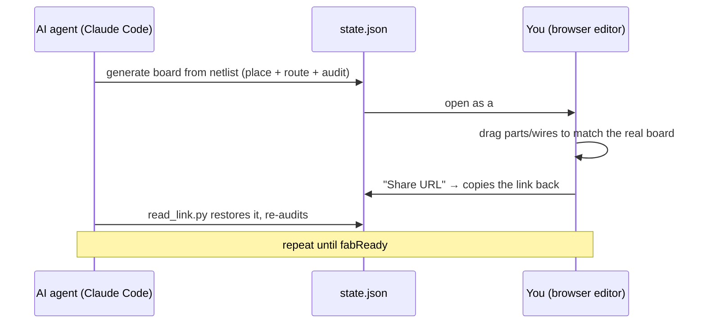

<div align="right">English | <a href="README.ja.md">日本語</a></div>

# perfwire

**Plan hand-soldered perfboard wiring — an AI agent drafts it, you drag it to match reality, and a deterministic ERC catches mistakes before you pick up the soldering iron.**

[](https://github.com/KeckuJp/perfwire/actions/workflows/ci.yml)
[](https://github.com/KeckuJp/perfwire/releases)
[](LICENSE)


<picture>
  <source media="(prefers-reduced-motion: reduce)" srcset="docs/media/demo-filmstrip.png">
  
</picture>

*(Animated GIF, ~2 s of motion, plays once — [static filmstrip](docs/media/demo-filmstrip.png) if it didn't load)*

1. Drag a wire endpoint off the hole it's connected to
2. The audit panel immediately flags the open net
3. Ctrl+Z restores the board to fab-ready

**Try it now:** clone the repo and open `index.html` in any browser — no install, no server, no
account. It opens with a real embedded example (a Raspberry Pi Pico plant-watering board) whose
"Before" version has three deliberate mistakes the audit already caught. Fix them by dragging and
watch the audit panel turn green.

- **One file.** `index.html` is the whole app — no build step, no npm, no server. Board state shares as a URL. Works offline.
- **Human + AI, split the right way.** Your agent generates placement and routing from a netlist; you drag parts to match the real board; a link hands it back.
- **Deterministic verification, not vibes.** Shorts, open nets, driver contention, decoupling distance — checked by a rule engine that ships identically in browser JS and Python, and CI enforces the two agree. The LLM proposes; it never gets to be the judge.

## Why perfwire?

Perfboard (ユニバーサル基板) builds fail in a predictable way: the netlist is right, but the
physical execution — which hole each jumper goes into, which pads get solder-bridged, where the
decoupling caps actually sit — drifts from the plan. Neither half of the job is well-served by
doing it alone: an AI agent can't see the real board on your desk, and manually tracking
hole-by-hole wiring rules in your head doesn't scale past a handful of parts.

perfwire splits the work the way it should be split, and the two sides talk to each other through
one shared JSON state file:



- **The AI agent** generates the board state from a netlist, allocates jumper endpoints to free holes (a copper wire can never share a hole with a component lead), proposes placements under physical and electrical constraints, and audits the result.
- **The human** drags things to match physical reality — locked parts, blocked holes, actual component positions — directly in a browser editor, then feeds the state back to the agent.

## Try it in 60 seconds

1. Clone this repo.
2. Open `index.html` in any modern browser (no install, no server, single file). A sample project is embedded: **Pico Plant Sitter**, a Raspberry Pi Pico plant-watering board with a "Before" proposal carrying three deliberate, solver-caught mistakes and a clean "Recommended" proposal.
3. Drag wire endpoints / parts, set thresholds with the sliders, hit **配線を再計算** (re-route) or **配置を再提案** (re-place & route).
4. **書き出し** exports the full state JSON — hand it to Claude Code for deeper audits, or commit it to your project repo.

## Works standalone. Better with an agent.

perfwire doesn't require Claude Code — it's a complete tool on its own, with an on-ramp if you want the AI-assisted loop:

1. **No AI at all** — open `index.html`, add parts from the palette or import a KiCAD netlist, drag, and let the built-in solver route and audit.
2. **Built-in solver** — pick a placement goal (easy-build / analog / compact), recalculate, export a build packet with a cut sheet.
3. **Full loop with Claude Code** — the agent generates board state from your schematic, runs deeper audits in `solver.py`, and trades the board back and forth with you through a URL.

## The loop with Claude Code

**Primary — clone and open as a project** (lowest friction):

```bash
git clone https://github.com/KeckuJp/perfwire.git
cd perfwire
claude .
```

Accept the workspace-trust prompt once; the bundled skill (`.claude/skills/perfwire/SKILL.md`) auto-loads and triggers on perfboard / wiring requests. It teaches the agent the state schema and the collaboration loop:

```
you:    "この回路をユニバーサル基板に組みたい" (hand it a netlist / schematic)
agent:  generates state JSON → solver.py places + routes + audits → hands back an index.html#z= link
you:    open the link → drag parts to match the real board → click "Share URL" (copies the link)
agent:  reads the pasted link back with read_link.py → re-audits → gives the next single step in plain language
        (a beginner repeats this small "send → drag → hand back" loop; every export is also saved
         to Downloads, so the agent can read that file directly instead)
```

When the agent builds the link with `make_link.py out.json --task "…what to do…"`, the editor shows a **Claude Code bar** across the top on arrival: the agent's instruction, a three-step loop reminder, and a **Return to Claude Code** button that copies the board as a link to paste back. The bar appears only for boards opened from a `#z=` link, so it guides a Claude-Code beginner without getting in a standalone user's way.

<details>
<summary>Alternative: install as a plugin, and troubleshooting notes</summary>

**Alternative — install as a plugin** (the repo doubles as its own single-plugin marketplace):

```
/plugin marketplace add KeckuJp/perfwire
/plugin marketplace update perfwire
/plugin install perfwire@perfwire
```

Third-party marketplaces don't auto-refresh, so always run `/plugin marketplace update perfwire`
before installing/reinstalling — otherwise you get the version cached at add-time. The plugin
bundles the same skill (namespaced `perfwire:perfwire`; `plugin.json` points its `skills` path at
`.claude/skills/`, so there is one copy, not two).

When consumed this way the bundled `solver.py` / `tools/*.py` / `config.example.json` / `index.html`
live in the plugin cache (`~/.claude/plugins/cache/…`), **not** your project, while your working
directory is your own repo. The skill locates them by an absolute plugin-root path and runs them
from any cwd.

> **Troubleshooting:** if the agent hits `Python was not found` (the Windows Store stub — the real
> interpreter is `python`) or `can't open file 'solver.py'`, it ran a bundled script from the wrong
> folder. Just re-ask Claude — it re-reads the skill and locates the plugin correctly. If it
> persists, `/plugin marketplace update perfwire` then reinstall.

> **Solver note:** use `python3` on macOS/Linux, `python` on Windows; `solver.py` is
> standard-library only (no install). `config.example.json` is the single threshold file and the
> solver's default `--config`, so a bare `solver.py board.json` already loads it. If no config is
> found the solver prints a `WARNING … EE audit DEGRADED` to stderr — it never degrades silently.
> To hand a board to a human pre-loaded, generate a deep link with
> `python3 tools/make_link.py out.json` and have them open the printed `index.html#z=…` URL.

</details>

## What it checks before you solder

The audit runs on the board graph before you touch a soldering iron. A handful of the checks:

| Check | Catches | Severity |
|---|---|---|
| `netMerge` / `stripShorts` | the board's own copper (an uncut mesh lattice, a stripboard segment) shorting nets your design assumed were isolated | hard NG |
| `openNets` / `unconnectedLeads` | a net the wiring doesn't fully connect, a part lead with no net assignment | hard NG |
| `multipleDrivers` | output-output contention — ≥2 driver terminals on one net, including an off-board driver arriving over a wire | hard NG |
| `duplicateIds` / `pinConflicts` | duplicate refdes, an output shorted to a power pin | hard NG |
| `polarity` | reversed electrolytic-capacitor polarity (opt-in via `rail_rank`) | hard NG |
| `decouplingCoverage` / `decouplingValueWarn` | a bypass cap placed too far from the pin it's supposed to serve, or an oversized value | threshold |
| `keepAway` | insufficient spacing around a high-impedance node | threshold |
| `resistorPower` | a resistor's dissipation exceeding its rated wattage (opt-in, needs `value` + `rail_volts`) | threshold |
| `powerReach` | a power net not actually reaching its declared supply entry (opt-in via `power_entry`) | threshold |
| `grounding` / `guard` / `crosstalk` | daisy-chained return paths, high-Z guard advisories, parallel-run coupling heuristics | advisory |

Full list and exact semantics: the `ee` block in the state schema below, and `solver.py --lint`
for a structured pre-flight check of the board JSON itself (missing fields, unknown `kind`,
duplicate refdes) before any of the above runs.

## Deterministic by design

perfwire ships the same electrical rule checker twice — once in browser JS, once in `solver.py`
for CLI and CI — and CI enforces that the two produce identical audit verdicts, field-by-field,
on every sample board. When your agent says a board is clean, that claim comes from a rule engine
you can read, not from a language model's confidence.

**This is advisory, not a safety certification** — a clean audit means the board passes the
specific checks above; it is not a guarantee the board is safe to power, and it doesn't replace an
independent human inspection before you apply power for the first time. See `SAFETY.md`.

<details>
<summary>The 7 gates CI runs on every push / PR</summary>

- `tools/extract_check.mjs` — parses the inline script of `index.html` (syntax gate) and validates the embedded sample data.
- `tools/i18n_check.mjs` — coverage gate: every runtime message must route its Japanese through `tr()`/`trf()` with a matching dictionary entry, so an EN user can never see a raw-Japanese toast.
- `tools/check_manifests.mjs` — validates `.claude-plugin/plugin.json` + `marketplace.json` (required fields, version agreement, skill path exists).
- `tools/parity_check.mjs` — golden test that the in-browser ERC audit and `solver.py` agree on every gate-affecting field, for both the config file and every sample proposal.
- `tools/parity_headless.mjs` — loads each sample into the real editor headlessly (via Chrome) and compares its full computed `ee` — including geometry fields like wire length and decoupling distance — against `solver.py`.
- `tools/ci_smoke.py` — runs `solver.py` on every sample proposal and asserts a schema-complete, fully-wired, and (where locked in) exact-findings output.
- `tools/consume_smoke.py` — proves the plugin works when **installed** (not just cloned): runs the documented commands from a separate consumer cwd against a throwaway plugin-cache copy.

</details>

## Features

**Physical-reality modeling**
- **Hole-accurate model** — one hole holds one lead or one wire end; jumper endpoints auto-allocate to free holes adjacent to their target net, bridged with solder; falls back to direct-soldering a lead only when no hole is free.
- **Physical footprints** — resistor capsules, electrolytic circles (per-part diameter override), film-cap boxes; bodies block holes; tall×tall overlaps are errors, tall×flat are warnings; vertical (standing) resistor mounting.
- **Open component model** (`kind` = geometric primitive, not a fixed parts list) — `ic` is a *generic named-pin part* (any number of pins, any layout), so a Raspberry Pi Pico, a relay, a connector, a header, or a transistor is modeled the same way; `r`/`disc`/`elec`/`film` are 2-lead parts, covering an inductor, a buzzer, or a ferrite bead with zero per-component code. New parts are added by researching the footprint and building it from a primitive, not by patching code.
  <details><summary>The boundary of what fits without code changes</summary>

  Genuinely non-through-hole / non-pin footprints (SMD pads, a TO-220 tab, a custom glyph) need
  code — perfwire is a through-hole, named-pin/axial planner. The optional `pkg`/`phys3d` fields
  (below) improve *how a part renders in 3D* without touching this constraint.
  </details>
- **Non-isolated board topologies** (`grid.type`) — real universal boards aren't all isolated pads. A single intrinsic-link generator feeds the same union-find ERC, so a design assuming isolated pads is flagged when the board's own copper shorts its nets. Supports `perf` (isolated, the default), `strip` (Veroboard), `mesh` (cross-wired boards like Akizuki P-09694 / Sunhayato UB-WRD01 — every hole bonded to its 4 neighbors until you cut it apart), `breadboard`, `cluster`, and `custom`.

**For the human: the editor**
- **WebGL 3D view** — drag to orbit freely, scroll to zoom. Parts render as their real package shapes (an LED's dome, a TO-220's heatsink tab, a pin header's individual pins — not a floating box), with bent leads and solder fillets so the board reads as *assembled*, not schematic. Hover or click a net on a dense board to ghost everything else. Falls back automatically to a fixed-angle view if WebGL isn't available.
  <details><summary>▶ Watch the 3D view (animated GIF, ~2 s of motion, loops)</summary>

  

  </details>
- **Photo underlay** — drop a photo of the real board under the grid (opacity / scale / rotation / mirror for backside shots) and trace reality by dragging parts onto it. AI guessing hole positions from photos fails; a human tracing over a photo doesn't.
- **Guided soldering mode** — walk the build one joint at a time on a dimmed board with the current step highlighted and named. Arrow keys to navigate, Enter to check off (progress persists), mirror view for soldering from the back side.
- **Virtual continuity tester** — click two holes, see whether the plan connects them. Exports a markdown beep-out checklist per net — including adjacent different-net pairs that must NOT beep.
- **Shareable URLs** — the full state compresses into `#z=...`; paste the link anywhere, no server needed. Opening a link adds the board as a new proposal — it never overwrites your local work.
- **Parts palette & KiCAD import** — add parts from a form with footprint-checked auto-placement, or drop a `.net` (s-expression) KiCAD netlist file to place 2-pin and DIP-8 parts on a fresh board, ready for the solver.
- **1:1 print & diff view** — print at exact 2.54mm pitch to verify against the real board; overlay the current board against its unedited original or any other proposal, with a delta summary.
- **Editor UX** — segmented modes, command palette (Ctrl+K), undo/redo, zoom / pinch zoom, hover inspector, layer toggles, lock parts, block holes, proposals as switchable tabs, autosave, JSON drag & drop. English / Japanese UI **and reports**, auto-detected.

**For the agent: CLI & round-trip**
- **Placement goals** — a good layout is set by an *intent*, not eight raw weights. `--profile easy|analog|compact` (or the editor's dropdown) share one vocabulary between agent and human; a goal changes only *how* parts are placed, never the audit's pass/fail criteria.
- **Guard-ring synthesis** — `--guard <net>` turns a high-Z guard advisory into an applied guard ring, offered as a new proposal. When the guard potential is ambiguous, it refuses to guess silently — it flags `ambiguous` and shows scored candidates.
- **Config scaffolder & build packet** — `--emit-config` derives a best-effort, review-me threshold file from a board; `--emit-packet` exports grouped BOM, per-jumper cut sheet, solder-bridge list, and a board PNG.
- **Value-aware EE** (optional `value`/`rail_volts` inputs) — resistor power-dissipation check, decoupling-value sanity, output-to-power pin-conflict check.
- **Input lint** — `--lint` validates a board's JSON against the schema contract and returns structured diagnostics instead of a Python traceback.
- **In-browser solver** — the same greedy placement + routing + audit engine runs client-side; tune thresholds with sliders and recalculate instantly.

## State schema (v1)

```jsonc
{
  "grid": { "cols": 17, "rows": 14 },
  "netColors": { "VCC": "#d62839" },
  "leads":  { "U1.8": { "net": "VCC", "at": [6, 2] },         // every occupied hole
              "W.MCU_TX": { "net": "TX", "at": [1, 4], "role": "out" } },  // off-board driver via a wire (optional role)
  "parts": [
    { "id": "U1", "kind": "ic", "label": "U1", "pins": { "1": [6,5] }, "locked": true,
      "pinTypes": { "1": "out", "2": "in", "8": "pwr_in" } },  // optional: enables out-out short / power-pin ERC
    { "id": "R1", "kind": "r", "label": "R1 1M", "leads": [[13,2],[16,2]],
      "leadNames": ["R1.a","R1.b"], "locked": false, "standing": false }
  ],
  "padBridges": [ [[5,1],[5,2]] ],                           // adjacent solder bridges
  "wires": [ { "net": "VCC",
    "a": { "tap": "U1.8", "pad": [6,2], "hole": [6,1], "bridgeTo": [6,2], "direct": false },
    "b": { "tap": "U2.8", "pad": [12,10], "hole": [12,9], "bridgeTo": [12,10], "direct": false } } ],
  "blockedHoles": [ [3,7] ]                                  // physically unusable holes
}
```

A wire endpoint is a `hole` (where the copper wire is inserted) plus a `bridgeTo` (the adjacent same-net hole it is solder-bridged to). `hole == pad` with `direct: true` means the wire is soldered straight onto the lead.

<details>
<summary>Bundled example/tooling files</summary>

`examples/pico_plant_sitter.json` (the embedded default, 2 proposals) and `examples/pico_motor_driver.json`
(a second Before/Recommended teaching example — a Raspberry Pi Pico + DRV8833 dual-motor driver),
`config.example.json` (the single threshold file for the Python solver, kept in lockstep with the
editor's embedded `DEFCFG` by `tools/parity_check.mjs`), `tools/make_link.py` (state JSON → `#z=`
editor deep link) and `tools/read_link.py` (the inverse).

</details>

## Background

Grew out of hand-building a real perfboard project: photo-based position guessing failed three times before the actual build matched the plan. The drag-editor + solver + audit loop is what finally worked, and perfwire is that workflow generalized into a standalone tool.

## Roadmap

A routed crosstalk model (today: an endpoint-segment heuristic, since jumper routes aren't
modelled) and further guard/keep-away refinements are the main open direction — see `CHANGELOG.md`
for everything already shipped.

## Feedback

Using perfwire with Claude Code? Just tell your agent — *"report this to perfwire."* The bundled
skill drafts the issue (version, environment, minimal repro) and **asks you before filing
anything**. Or file directly: [bug report](../../issues/new?template=1_bug_report.yml) ·
[ERC dispute](../../issues/new?template=2_erc_dispute.yml) ·
[feature request](../../issues/new?template=3_feature_request.yml).

## Contributing & translations

See `CONTRIBUTING.md` — includes the verification-gate commands and the guide for adding a new
translated README.

## License

MIT
