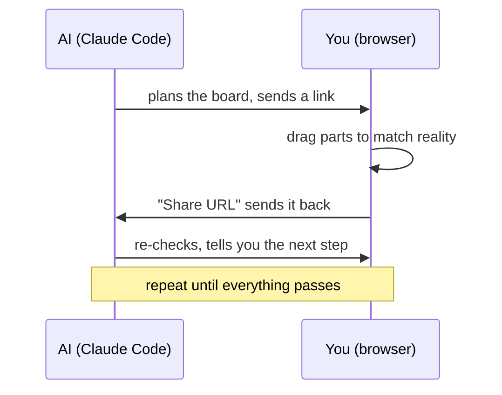

<div align="right">English | <a href="README.ja.md">日本語</a></div>

# perfwire

**AI plans your perfboard wiring. You drag it to match the real board. A rule checker catches the mistakes — before you solder.**

[](https://github.com/KeckuJp/perfwire/actions/workflows/ci.yml)
[](https://github.com/KeckuJp/perfwire/releases)
[](LICENSE)


<picture>
  <source media="(prefers-reduced-motion: reduce)" srcset="docs/media/demo-filmstrip.png">
  
</picture>

*Break a wire → the audit flags it instantly → Ctrl+Z fixes it.
(GIF plays once — [static version](docs/media/demo-filmstrip.png))*

**Try it right now:** clone this repo and open `index.html` in your browser. That's the entire install. A sample board is already loaded — its "Before" version has three planted mistakes the checker has already found. Fix them by dragging.

- **One file.** The whole app is `index.html`. No install, no server, no account. Works offline. A board shares as a URL.
- **You + AI, each doing what you're good at.** The AI plans placement and wiring. You drag things to match the board on your desk. A link hands it back.
- **Real checks, not AI guesses.** Shorts, missed connections, backwards capacitors — caught by a rule engine, not by a language model's opinion. The AI proposes; it never gets to be the judge.

## The problem

Perfboard projects rarely fail because the circuit was wrong. They fail during the build: a jumper goes into the wrong hole, a solder bridge lands one pad off, a capacitor ends up too far from the pin it protects. An AI can't see the board on your desk — and keeping every hole in your head stops working past a dozen parts.

So perfwire splits the job:



The AI does the bookkeeping (which hole, which bridge, which rule). You do the part only a human can: making the plan match the physical board.

## Try it in 60 seconds

1. Clone this repo.
2. Open `index.html` in any browser. The **Pico Plant Sitter** sample (a Raspberry Pi Pico watering monitor) is already loaded, in two versions: "Before" with 3 mistakes, "Recommended" all green.
3. Drag parts and wire ends around. Hit **Rewire** or **Re-place & route** and watch the audit panel react.
4. **Export** saves the board as one JSON file — commit it, share it, or hand it to Claude Code.

## Works alone. Better with an AI.

No Claude Code? No problem — perfwire is a complete tool by itself:

1. **Just the browser** — add parts from the palette (or import a KiCAD netlist), drag, and let the built-in solver wire and check everything.
2. **Pick a goal** — "easy to build", "analog/sensitive", or "compact" — and let it re-place the board. Export a build sheet with cut lengths.
3. **Add Claude Code** and the loop closes: describe your circuit in plain words, get a planned board back as a link, drag, return, repeat.

## Using it with Claude Code

```bash
git clone https://github.com/KeckuJp/perfwire.git
cd perfwire
claude .
```

That's it — the bundled skill loads automatically and wakes up when you ask about perfboard wiring:

```
you:    "I want to build this circuit on perfboard" (give it a schematic or netlist)
agent:  plans the board → sends you a link
you:    open it → drag parts to match your real board → click "Share URL"
agent:  reads the link back → re-checks → tells you the next step
```

When the board arrives from the agent, a **Claude Code bar** appears at the top of the editor with the agent's instruction and a **Return to Claude Code** button — so even a first-time user knows exactly what to do next.

<details>
<summary>Install as a plugin instead / troubleshooting</summary>

The repo doubles as its own plugin marketplace:

```
/plugin marketplace add KeckuJp/perfwire
/plugin marketplace update perfwire
/plugin install perfwire@perfwire
```

Always run the `update` line before installing — third-party marketplaces don't refresh themselves.

When installed as a plugin, the bundled files live in the plugin cache (`~/.claude/plugins/cache/…`), not your project. The skill finds them by absolute path, so this just works — but if the agent ever complains `Python was not found` or `can't open file 'solver.py'`, just ask again (it re-reads the skill), or re-run the `update` + install lines.

CLI notes: `solver.py` is standard-library Python only — `python3` on macOS/Linux, `python` on Windows. It loads `config.example.json` automatically; if no config is found it warns loudly (`EE audit DEGRADED`) rather than silently checking less. `tools/make_link.py out.json` turns a board file into a shareable `#z=` link.

</details>

## What it checks before you solder

A few examples of what the audit catches:

| It catches | Example | Severity |
|---|---|---|
| The board's own copper shorting your nets | an uncut strip or cross-wired lattice connecting two nets | hard NG |
| Broken or missing connections | a net the wiring never completes, a lead with no net | hard NG |
| Two outputs fighting on one net | including an off-board driver arriving over a wire | hard NG |
| A backwards electrolytic capacitor | polarity checked against the power rails | hard NG |
| A decoupling cap too far from its pin | distance measured on the actual board | threshold |
| A resistor over its power rating | if you give it values and rail voltages | threshold |
| Risky grounding / crosstalk patterns | daisy-chained returns, long parallel runs | advisory |

Everything lands in one verdict: **fab-ready, or a list of exactly what to fix.**

## Why you can trust the result

The same rule checker is implemented twice — once in the browser, once in Python (`solver.py`) — and CI fails if the two ever disagree on any check, on any sample board. When the AI says your board is clean, that claim comes from a rule engine you can read, not from a model's confidence.

**One honest caveat:** a clean audit means these specific checks passed. It is not a certificate that the board is safe to power — always give a real board a human once-over before first power-on. See [`SAFETY.md`](SAFETY.md).

<details>
<summary>The 7 CI gates that run on every push</summary>

- `extract_check.mjs` — the inline app script parses; embedded sample data is valid.
- `i18n_check.mjs` — every UI message exists in both English and Japanese.
- `check_manifests.mjs` — plugin/marketplace manifests agree; READMEs cross-link.
- `parity_check.mjs` — browser ERC and `solver.py` agree field-by-field on every sample.
- `parity_headless.mjs` — the real editor, run headlessly, matches `solver.py` including geometry.
- `ci_smoke.py` — `solver.py` fully wires every sample and reproduces its locked-in findings.
- `consume_smoke.py` — the plugin works when *installed*, not just when cloned.

</details>

## Features

**Models the physical board, not an abstract schematic**
- One hole = one lead or one wire end. Jumpers land in free holes next to their target and get solder-bridged — exactly like on a real board.
- Real footprints with cited dimensions: parts block holes, tall parts can't overlap, resistors can stand vertically.
- Any part fits: a Pico, a relay, a connector — anything with pins is an `ic`; anything with 2 leads is a resistor-like part. No per-component code.
- Knows real board types: plain perfboard, stripboard/Veroboard, and cross-wired boards (every hole pre-connected to its neighbors — the audit flags every cut you need to make).

**For you: the editor**
- **3D view** — drag to orbit, scroll to zoom. Parts render as their real shapes with bent leads and solder fillets. Hover a net to dim everything else.
  <details><summary>▶ Watch the 3D view (GIF, loops)</summary>

  

  </details>
- **Photo underlay** — put a photo of your real board under the grid and trace it by dragging parts onto it.
- **Guided soldering** — one joint at a time, current step highlighted, mirror view for the solder side, progress saved.
- **Virtual continuity tester** — click two holes to see if they should beep; export a multimeter checklist per net.
- **Share as a URL** — the whole board compresses into the link itself. No server, no account.
- Plus: KiCAD netlist import, 1:1 printing, a diff view against any earlier version, undo/redo, command palette, autosave, full English/Japanese UI.

**For the AI: a CLI it can drive**
- `solver.py` places, wires, and audits from the command line — same engine, same results as the browser.
- Placement goals (`--profile easy|analog|compact`), guard-ring synthesis, a config scaffolder, build-packet export, and structured input linting.

<details>
<summary>State schema (v1) — the one JSON file both sides read and write</summary>

```jsonc
{
  "grid": { "cols": 17, "rows": 14 },
  "netColors": { "VCC": "#d62839" },
  "leads":  { "U1.8": { "net": "VCC", "at": [6, 2] },         // every occupied hole
              "W.MCU_TX": { "net": "TX", "at": [1, 4], "role": "out" } },  // off-board driver (optional role)
  "parts": [
    { "id": "U1", "kind": "ic", "label": "U1", "pins": { "1": [6,5] }, "locked": true,
      "pinTypes": { "1": "out", "2": "in", "8": "pwr_in" } },  // optional: enables driver-contention / power-pin checks
    { "id": "R1", "kind": "r", "label": "R1 1M", "leads": [[13,2],[16,2]],
      "leadNames": ["R1.a","R1.b"], "locked": false, "standing": false }
  ],
  "padBridges": [ [[5,1],[5,2]] ],                           // adjacent solder bridges
  "wires": [ { "net": "VCC",
    "a": { "tap": "U1.8", "pad": [6,2], "hole": [6,1], "bridgeTo": [6,2], "direct": false },
    "b": { "tap": "U2.8", "pad": [12,10], "hole": [12,9], "bridgeTo": [12,10], "direct": false } } ],
  "blockedHoles": [ [3,7] ]                                  // physically unusable holes
}
```

A wire endpoint is a `hole` (where the copper wire goes in) plus a `bridgeTo` (the adjacent same-net hole it's solder-bridged to). Bundled: two teaching examples (`examples/`), the solver config (`config.example.json`), and `tools/make_link.py` / `tools/read_link.py` for turning boards into links and back.

</details>

## Background

perfwire grew out of hand-building a real perfboard project. Guessing hole positions from photos failed three times; the drag-editor + solver + audit loop is what finally produced a board that matched the plan. This tool is that workflow, generalized.

## Feedback

Using perfwire with Claude Code? Just tell your agent — *"report this to perfwire."* It drafts the issue and **asks you before filing anything**. Or file directly: [bug report](../../issues/new?template=1_bug_report.yml) · [audit verdict dispute](../../issues/new?template=2_erc_dispute.yml) · [feature request](../../issues/new?template=3_feature_request.yml).

## Contributing & translations

See [`CONTRIBUTING.md`](CONTRIBUTING.md) — includes the verification-gate commands and how to add a new README translation.

## License

Apache License 2.0 — see [`LICENSE`](LICENSE) and [`NOTICE`](NOTICE).
